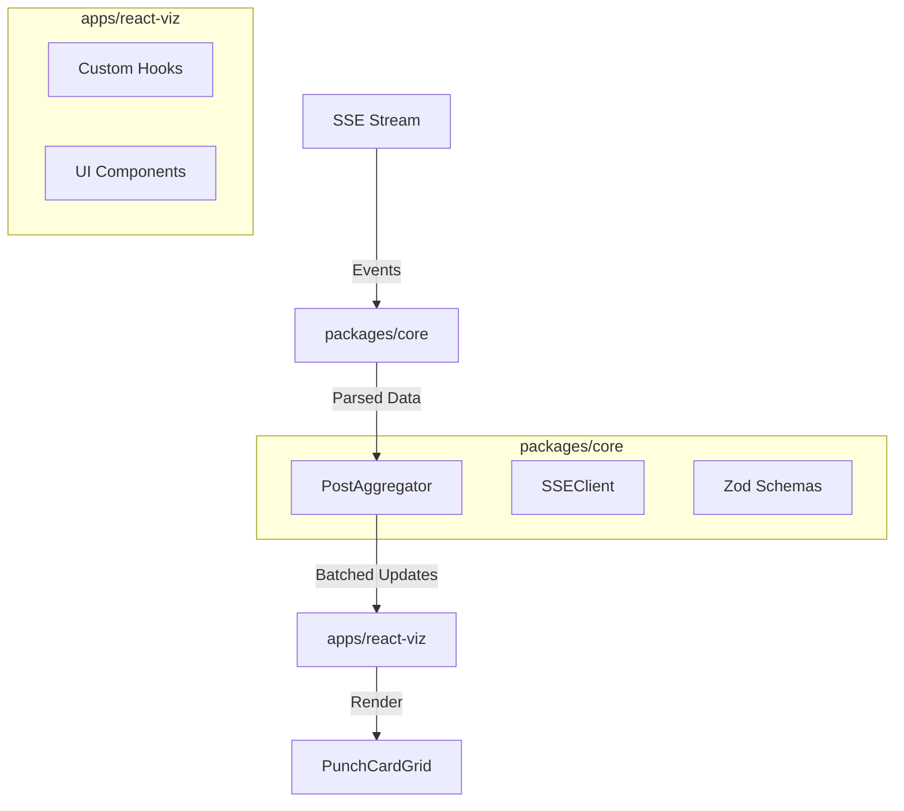

# Upfluence Coding Challenge - Real-time Social Media Visualization

A high-performance, real-time 3D visualization of social media posts using Server-Sent Events (SSE). Built with a modern monorepo architecture to demonstrate production-ready patterns.


## 🚀 Features

- **Real-time Visualization**: Updates instantly via SSE stream (<5s latency).
- **3D Punch Card**: Visualizes posts by Day of Week × Hour of Day.
- **Multi-type Support**: Handles 6 distinct post types simultaneously.
- **High Performance**: Optimized aggregation engine handles 1000+ posts/sec.
- **Resilience**: Automatic reconnection with exponential backoff.
- **Production Polish**: Error boundaries, loading states, and performance metrics.

## 🏗 Architecture

The project uses a **Turborepo** monorepo structure to separate concerns and ensure scalability.



### Key Components

- **`packages/core`**: Framework-agnostic business logic.
  - `SSEClient`: Manages connection stability.
  - `PostAggregator`: O(1) data structure for efficient updates.
  - `Zod Schemas`: Runtime validation for type safety.
- **`apps/react-viz`**: React 19 SPA with Vite.
  - `useAggregator`: Batches updates to prevent UI thrashing.
  - `PunchCardGrid`: Responsive CSS Grid visualization.

## 🛠 Getting Started

### Prerequisites

- Node.js 18+
- pnpm 8+ (recommended)

### Installation

```bash
# Clone the repository
git clone https://github.com/edouardmisset/upfluence-challenge.git

# Install dependencies
pnpm install

# Start development server
pnpm dev
```

Open `http://localhost:3000` to view the landing page.
The React application runs on port 3001 but is proxied through the landing page.

## 🧪 Testing & Quality

The core logic is fully unit tested using Vitest.

```bash
# Run all tests
pnpm test

# Run linting
pnpm lint

# Run formatting
pnpm format
```

## 💡 Technical Decisions

| Decision     | Alternative   | Rationale                                                                                    |
| ------------ | ------------- | -------------------------------------------------------------------------------------------- |
| **Monorepo** | Single Repo   | Separates core logic from UI, enabling future multi-framework implementations (e.g., Ember). |
| **pnpm**     | npm/yarn      | Faster installation and efficient disk usage via content-addressable storage.                |
| **Zod**      | Manual Checks | Provides runtime type safety and automatic TypeScript type inference.                        |
| **React**    | Ember/Vue     | Chosen for rapid prototyping speed.                                                          |
| **CSS Grid** | Canvas        | Sufficient performance for 7x24 grid while remaining accessible and easy to style.           |

### Code Conventions

- **File Naming**: All files use `kebab-case` (e.g., `post-aggregator.ts`, `post-type-card.tsx`) to ensure consistent behavior across case-sensitive (Linux) and case-insensitive (macOS/Windows) file systems.

## ⚖️ Trade-offs

- **Memory Usage**: The aggregator keeps all data in memory. For a production app running for days, I would implement a sliding window (e.g., keep only last 7 days) or persist to IndexedDB.
- **Visualization**: A Canvas-based approach (like Visx or raw Canvas) would be more performant for massive datasets, but DOM nodes are sufficient for this specific grid size (168 cells per card).
- **State Management**: Used React Context/Local State for simplicity. For a larger app, I would reach for Zustand or TanStack Query.

## 🔮 Future Improvements

- **Ember Implementation**: Add `apps/ember-viz` to demonstrate framework versatility.
- **Data Persistence**: Save aggregated state to `localStorage` to survive refreshes.
- **Dark Mode**: Fully implemented theming support.

## 👤 Author

Edouard Misset

---

_Built for the Upfluence Coding Challenge._
