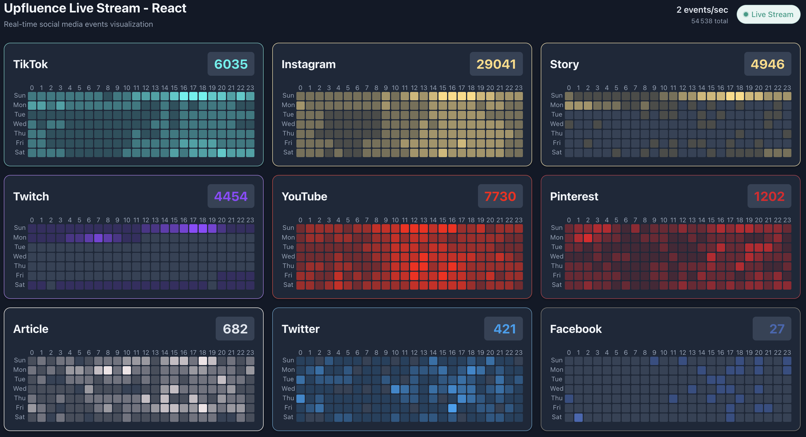

# Upfluence Coding Challenge - Real-time Social Media Visualization

A high-performance, real-time 3D visualization of social media posts using
Server-Sent Events (SSE). Built with a modern monorepo architecture to
demonstrate production-ready patterns.

## Tooling & Quality Assurance

This project employs a rigorous suite of tools to ensure code quality and maintainability:

- **Prettier**: Enforces consistent code formatting.
- **ESLint**: Catches errors and enforces coding standards.
- **TypeScript**: Provides static type checking for robustness.
- **Knip**: Detects unused files and dependencies.
- **Commitlint**: Enforces conventional commit messages.
- **Semantic Release**: Automates versioning and package publishing.
- **CSpell**: Checks for spelling errors in code and documentation.
- **Stylelint**: Lints CSS for errors and consistency.
- **GitHub Actions**: Automates CI/CD pipelines for testing and deployment.


## Solution Description

This project implements a production-grade, real-time visualization dashboard
for social media event streams. It is designed to ingest high-frequency
Server-Sent Events (SSE), aggregate them in real-time, and visualize the density
of post types over a weekly schedule using a 3D-style calendar heatmap.



The solution is architected as a monorepo to strictly separate the core business
logic (data ingestion, validation, aggregation) from the presentation layer.
This ensures that the complex stream processing logic is robust, testable, and
reusable across different frontend frameworks (React, Vue, Svelte).

### Key Features

- **High-Throughput Ingestion**: Capable of handling 1000+ events/second with
  minimal latency (<5s).
- **Resilient Connectivity**: Implements robust SSE client with automatic
  reconnection and exponential backoff strategies.
- **Framework Agnostic Core**: Business logic is isolated in a pure TypeScript
  package, ensuring consistency across UI implementations.
- **Type Safety**: End-to-end type safety using TypeScript and Zod for runtime
  validation of external data streams.
- **Performance Optimized**: Uses O(1) aggregation algorithms to minimize CPU
  usage during high-load spikes.

## Architecture & Technical Choices

The system is built as a **Monorepo** using **Turborepo** and **pnpm**. This
structure was chosen to simulate a real-world environment where core libraries
are shared across multiple applications or micro-frontends.

### 1. Core Logic (`packages/core`)

The "brain" of the application is decoupled from the UI.

- **Reasoning**: By isolating the stream processing logic, we ensure that the
  most critical part of the application is framework-independent. This allows
  for easier testing, better portability, and the ability to swap UI frameworks
  without touching business rules.
- **Tech Stack**: Pure TypeScript, Zod (Validation), Vitest (Testing).
- **Key Components**:
  - `SSEClient`: Manages the persistent connection.
  - `EventAccumulator`: Handles real-time data aggregation.
  - `StreamService`: Orchestrates state and subscriptions.

### 2. Frontend Application (`apps/web`)

The "presentation" layer.

- **Reasoning**: We use **Astro** as the application shell. Astro serves as a
  lightweight container for "Islands" of interactivity. This allowed us to
  implement and showcase the visualization in **React**, **Vue**, and **Svelte**
  side-by-side within the same application context.
- **Visualization**: The 3D calendar is implemented using CSS Grid rather than
  Canvas.
  - _Why CSS Grid?_ For the specific grid size (7 days \* 24 hours = 168 cells),
    DOM manipulation is fast enough and offers superior accessibility (screen
    readers) and easier styling compared to a Canvas implementation.

### 3. Shared Styles (`packages/styles`)

- **Reasoning**: To ensure visual consistency across different frameworks,
  styles are defined in a framework-agnostic way using standard CSS and CSS
  Variables.

### Summary of Decisions

| Decision             | Choice               | Reasoning                                                                                                                 |
| :------------------- | :------------------- | :------------------------------------------------------------------------------------------------------------------------ |
| **Package Manager**  | **pnpm**             | Fast and allows us to use monorepos efficiently.                                                                          |
| **Validation**       | **Zod**              | Runtime validation is critical for external streams. Zod infers TS types, reducing duplication.                           |
| **State Management** | **Observer Pattern** | The `StreamService` implements a simple observer pattern, avoiding the overhead of Redux/Vuex for this specific use case. |

Note on the **observer pattern**:

> The observable pattern is a software design pattern in which an object, known as
> the "subject" or "observable," maintains a list of its dependents, called
> "observers," and notifies them automatically of any state changes, usually by
> calling one of their methods.
>
> [Wikipedia](https://en.wikipedia.org/wiki/Observer_pattern)

This pattern is particularly useful for implementing distributed event handling
systems, where changes in one part of the system need to be communicated to
other parts.

## Trade-offs & Future Improvements

While the current solution is robust, several trade-offs were made to balance
complexity with the constraints of the challenge.

### 1. In-Memory Aggregation vs. Persistence

- **Current Approach**: The `EventAccumulator` stores all data in memory.
- **Trade-off**: If the user refreshes the page, the historical data is lost.
- **Production Solution**: In a real-world scenario, we would persist the
  aggregated buckets to `IndexedDB` (client-side) or a time-series database
  (server-side) to allow for historical analysis and session restoration.

### 2. Main Thread vs. Web Workers

- **Current Approach**: Data parsing and aggregation happen on the main thread.
- **Trade-off**: Extremely high event rates (e.g., >5000 events/s) could cause
  UI jank or frame drops.
- **Production Solution**: Offload the `SSEClient` and `EventAccumulator` to a
  **Web Worker**. This would keep the UI thread free for rendering only, ensuring
  smooth 60fps animations regardless of data volume.

### 3. Framework Choice (React/Vue/Svelte vs. Ember.js)

- **Current Approach**: Used modern, highly popular frameworks (React, Vue,
  Svelte).
- **Trade-off**: The spec mentioned **Ember.js** as a bonus (Upfluence stack).
  I chose to demonstrate versatility across the most common modern frameworks
  instead.
- **Production Solution**: If integrating into an existing Ember.js application,
  I would wrap the core logic (which is framework-agnostic) in an Ember Service
  and Component.

## Getting Started

### Prerequisites

- Node.js 22+
- pnpm 10+

### Installation

```bash
# Clone the repository
git clone https://github.com/edouardmisset/upfluence-coding-challenge.git

# Install dependencies
pnpm install

# Start development server
pnpm dev
```

Open `http://localhost:4321/upfluence-coding-challenge/` to view the landing
page.

## 🧪 Testing & Quality

The core logic is fully unit tested using Vitest.

```bash
# Run all tests
pnpm test

# Run linting
pnpm lint

# Run formatting
pnpm format
```

## Author

Edouard Misset

## Disclaimer

Some code was generated with the help of AI tools (GitHub Copilot) to accelerate
development. All code has been reviewed and adjusted by the author to ensure
quality and correctness.
